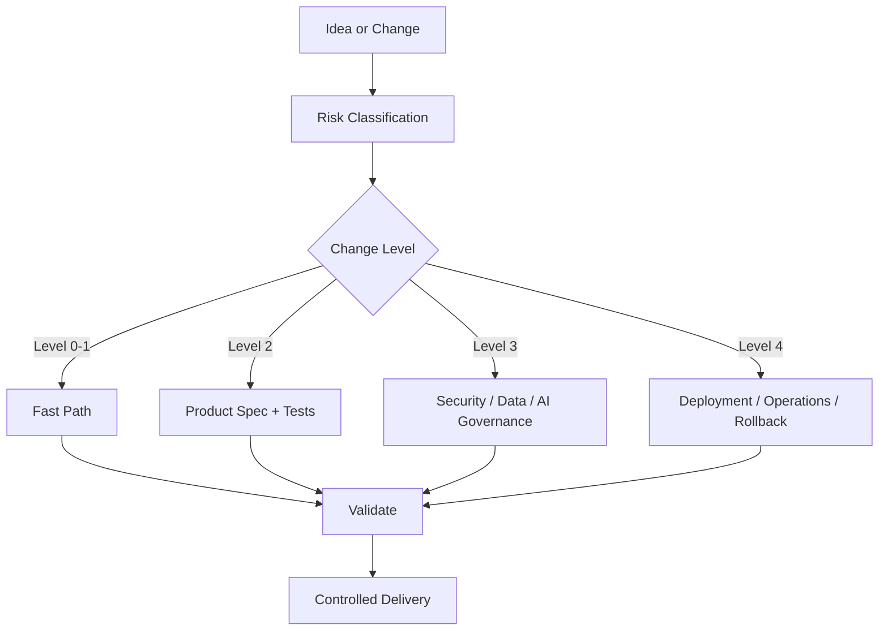

<p align="center">
  
</p>

<h1 align="center">PSDM Framework</h1>

<p align="center">
  <strong>Specification-first governance for AI-assisted software engineering.</strong>
</p>

<p align="center">
  
  
  =20.0.0" />
  
  
</p>

<p align="center">
  <strong>AI writes code. PSDM governs it.</strong>
</p>

<p align="center">
  Govern AI-assisted software delivery with specification, architecture, risk-based controls, and production-ready governance.
</p>

PSDM Framework helps repositories, teams, developers, AI agents, technical leads, and product teams keep delivery controlled while moving quickly.

AI-assisted development is fast, but speed without governance creates risk.

PSDM helps teams decide how much process a change needs based on risk: small safe changes stay fast; security, data, AI, infrastructure, and production-sensitive changes get stronger governance.

PSDM is currently beta software. It is a local CLI and GitHub Action, not a hosted platform.

Try it locally:

```bash
npm install -g .
psdm audit
```

## Table Of Contents

- [Why PSDM Exists](#why-psdm-exists)
- [Governance Flow](#governance-flow)
- [What PSDM Provides](#what-psdm-provides)
- [Status](#status)
- [Install Locally](#install-locally)
- [CLI](#cli)
- [Quick Start](#quick-start)
- [Model And Tool Independence](#model-and-tool-independence)
- [Common Workflows](#common-workflows)
- [Local Validation](#local-validation)
- [Contributing And Security](#contributing-and-security)
- [What PSDM Is Not](#what-psdm-is-not)
- [Examples](#examples)
- [Configuration](#configuration)
- [Feature Artifacts](#feature-artifacts)
- [Backend And Platform Governance](#backend-and-platform-governance)
- [Change Levels](#change-levels)
- [Production Gate](#production-gate)
- [GitHub Action](#github-action)
- [Design Principles](#design-principles)
- [Current Limitations](#current-limitations)

## Why PSDM Exists

AI can generate code quickly. Repositories still need durable context: product intent, specifications, architecture decisions, test expectations, security boundaries, deployment rules, and operational ownership.

PSDM gives AI-assisted teams a repeatable governance layer. It helps developers, AI agents, technical leads, and product teams classify change risk, create the right artifacts, and keep delivery controlled without forcing heavyweight process onto small changes.

## Governance Flow



## What PSDM Provides

- Repository audit before adoption.
- Governance templates for specs, architecture, security, testing, deployment, operations, and ADRs.
- Change-level classification from descriptions and touched paths.
- CI enforcement for maximum allowed change level.
- AI readiness checks for guardrails, data classification, cost, latency, evals, prompt injection, PII, and tool security.
- AI-agent governance templates for projects using LLMs, tools, prompts, RAG, or automation.
- JSON output for automation and GitHub Action workflows.
- Public beta release gates for package contents, docs, and repository readiness.

## Status

`1.0.0-beta.1`

## Install Locally

```bash
npm install -g .
```

Then run:

```bash
psdm help
```

After beta publication:

```bash
npm install -g @ptechsolution/psdm-framework@beta
```

## CLI

### Repository

```bash
psdm audit [target] [--json] [--feature <name>] [--config <path>]
psdm check [target] [--json] [--feature <name>] [--config <path>]
psdm validate [target] [--json] [--feature <name>] [--config <path>]
psdm report [target] [--json] [--feature <name>] [--config <path>]
```

### Initialization

```bash
psdm init [target]
psdm init [target] --dry-run
psdm init [target] --feature <name>
```

### Governance

```bash
psdm classify "<change description>" [--json] [--file <path>] [--files <path,path>] [--target <path>] [--config <path>]
psdm enforce "<change description>" [--json] [--max-level "Level 2"] [--file <path>] [--files <path,path>] [--target <path>] [--config <path>]
psdm pr-checklist "<change description>" [--json] [--file <path>] [--files <path,path>] [--target <path>] [--config <path>]
```

### Architecture

```bash
psdm adr "<decision title>" [--json] [--target <path>] [--date YYYY-MM-DD] [--status Proposed]
```

## Quick Start

Inside a project:

```bash
psdm audit
# Analyze repository readiness before writing files.

psdm init
# Bootstrap PSDM governance artifacts.

psdm validate
# Validate the governance baseline.
```

Use `psdm audit` before initializing PSDM in an existing project. It does not modify files; it shows current state, what `psdm init` would create or skip, pros, cons, and recommendations.

If the repository already has `AGENTS.md`, Copilot, Cursor, Claude, Codex, skills, prompts, or AI instruction files, `psdm audit` reports adoption mode `integrate` and recommends preserving those files. During `psdm init`, PSDM creates `docs/PSDM_ADOPTION.md` so the integration plan is explicit.

`psdm audit --json` also emits `aiReadiness`, a stable contract for AI runtime readiness signals. It reports detected AI surfaces, governance artifact groups, gaps, and recommendations for guardrails, data classification, cost, latency, evals, prompt injection, PII, and tool security. Current detection covers common AI folders and manifest dependencies such as OpenAI, Anthropic, LangChain, LlamaIndex, vector stores, embeddings, and n8n. The contract is documented in `docs/AI_READINESS_AUDIT.md`.

`psdm init` also creates `psdm.config.json`. Existing files are skipped.

## Model And Tool Independence

PSDM is independent from any specific model, provider, coding assistant, or init command. It does not replace `claude init`, Cursor rules, Copilot instructions, Codex instructions, custom skills, prompts, or agent runtimes. It gives them a shared governance layer.

Teams customize PSDM through `psdm.config.json`, `AGENTS.md`, `docs/CHANGE_GOVERNANCE.md`, `docs/TOOL_REGISTRY.md`, and AI guardrail docs. Tool-specific files should adapt those rules for a given assistant, but must not weaken PSDM change-level, security, data, deployment, approval, or release boundaries.

See `docs/MODEL_AND_TOOL_INDEPENDENCE.md` for customization examples.

## Common Workflows

### Classify a Change

```bash
psdm classify "change Supabase RLS policy for client documents"
```

Expected result:

```text
Estimated level: Level 3
```

Machine-readable output:

```bash
psdm audit --json
psdm validate --json
psdm classify "change Stripe webhook ownership validation" --json
```

Classify by description and touched files:

```bash
psdm classify "small cleanup" --file backend/auth/session.py
```

Configured risk paths can raise the level even when the description is vague:

```text
Estimated level: Level 3
```

### Generate A PR Checklist

Generate a PR checklist:

```bash
psdm pr-checklist "change auth session validation" --file backend/auth/session.py
```

### Enforce In CI

Enforce a maximum level in CI:

```bash
psdm enforce "small cleanup" --file src/index.mjs --max-level "Level 2"
```

### Create An ADR

Create an ADR:

```bash
psdm adr "Adopt CI change level enforcement"
```

## Local Validation

Run local fixtures:

```bash
npm test
```

Run the non-publishing release gate:

```bash
npm run release:check
```

Use `npm run release:check -- --allow-dirty` only when validating local changes before commit.

Beta release scope and exit criteria are tracked in `docs/BETA_RELEASE_NOTES.md`.

The public documentation index is `docs/INDEX.md`.

## Contributing And Security

Public contribution expectations are in `CONTRIBUTING.md` and `CODE_OF_CONDUCT.md`.

Security reporting expectations are in `SECURITY.md`. Do not open public issues for secrets, credentials, exploitable behavior, private repository output, or customer data.

## What PSDM Is Not

PSDM is not a hosted observability platform, a runtime security product, a secret scanner, or a replacement for owner approval. It provides governance artifacts, local validation, change classification, CI enforcement hooks, and AI-agent guardrail templates.

## Examples

`examples/nextjs-saas` is a lightweight SaaS/AI fixture used by `npm test`.

It is not a runnable application. It exists to prove that PSDM can audit, initialize, and validate a downstream-like project with package metadata, prompt assets, and an AI-assisted backend surface without requiring external services or dependency installation.

## Configuration

`psdm.config.json` is optional. When it is absent, PSDM uses the default baseline artifacts.

Minimal example:

```json
{
  "profile": "backend-api"
}
```

Use the README to start. Use `docs/CONFIG_SCHEMA.md` for the full schema, supported fields, compatibility rules, AI policy fields, and `riskPaths` examples.

Supported profiles:

```text
standard
framework
backend-api
ai-agent
saas
monorepo
```

Profiles add sensible default artifacts and risk paths for common repository types. Explicit config still wins for project-specific policy.

The `ai-agent` profile adds guardrail artifacts for AI runtime governance:

```text
docs/AI_GUARDRAILS.md
docs/DATA_CLASSIFICATION.md
docs/COST_LATENCY_BUDGET.md
docs/PROMPT_INJECTION_TESTS.md
docs/AI_EVALS.md
```

These artifacts define policy, evidence, owners, gates, and accepted external reports. They do not turn PSDM into a native tracing, observability, or hosted eval platform.

Unsupported profile values fail validation instead of silently falling back to `standard`. The validation JSON still reports `config.profile.name` and `config.profile.recognized` so automation can surface the exact policy problem.

Schema stability rules are documented in `docs/CONFIG_SCHEMA.md`.

The optional `ai` block declares repository-level AI policy for PII, redaction, cost budgets, latency SLOs, tool registry expectations, eval requirements, prompt-injection testing, and human approval. `null` means the policy is intentionally not declared yet; invalid field types fail validation.

Use a non-default config path:

```bash
psdm validate --config ./governance/psdm.config.json
```

## Feature Artifacts

For product changes that should not require rewriting the whole project baseline, create scoped artifacts:

```bash
psdm init --feature billing
psdm validate --feature billing
```

Default feature paths:

```text
docs/features/<feature>/PROJECT_BRIEF.md
docs/features/<feature>/SPEC.md
docs/features/<feature>/ARCHITECTURE.md
docs/features/<feature>/SECURITY.md
docs/features/<feature>/TESTING.md
```

## Backend And Platform Governance

PSDM governs the whole repository, but its strongest controls usually apply to backend and platform surfaces:

- authentication and authorization;
- payments and billing;
- database migrations;
- infrastructure and deployment;
- AI agents and RAG pipelines;
- CI/CD workflows.

These controls live in `riskPaths`. A matching path raises the minimum change level even when the textual change description looks low risk.

`psdm validate` fails when `riskPaths` contains malformed rules. Invalid risk path rules are ignored by classification so a broken local policy does not crash the CLI.

## Change Levels

| Level | Meaning | Governance |
|---|---|---|
| Level 0 | Safe trivial change | Diff review only. |
| Level 1 | Local low-risk code change | Scope note, relevant docs, narrow validation. |
| Level 2 | Product behavior change | Product spec, tasks, testing, architecture review if needed. |
| Level 3 | Security / data / payment / AI change | Spec, architecture, security, testing, owner approval. |
| Level 4 | Deployment / operations / infrastructure change | Deployment, operations, rollback plan, explicit production confirmation. |

## Production Gate

Production execution is never implied.

Commands that mutate production require exact owner confirmation:

```text
CONFIRM PRODUCTION DEPLOY
```

## GitHub Action

This repository includes a composite GitHub Action:

Replace `<owner>` with the public GitHub owner for the repository.

```yaml
steps:
  - uses: actions/checkout@v4
  - uses: <owner>/psdm-framework@main
    with:
      target: .
```

The action writes `psdm-report.json` and fails when validation has blocking failures.

Enable change-level enforcement:

```yaml
steps:
  - uses: actions/checkout@v4
  - uses: <owner>/psdm-framework@main
    with:
      target: .
      enforce-change-level: 'true'
      change-description: ${{ github.event.pull_request.title }}
      files: src/index.mjs,docs/SPEC.md
      max-level: Level 2
```

The action writes `psdm-enforcement.json` and fails when the classified change exceeds `max-level`.

## Design Principles

- Risk-scaled governance.
- Specification before significant implementation.
- Explicit AI-agent boundaries.
- Security-sensitive work requires security context.
- Deployment-sensitive work requires rollback context.
- Documentation must support delivery, not replace it.

## Current Limitations

This beta does not yet provide:

- Full AI agent security runtime guardrail enforcement.
- Tool registry enforcement.
- Deep code-level semantic AI readiness detection.
- SBOM or supply-chain scanning.
- Deep semantic validation of specs.

Freshly initialized templates intentionally contain placeholders. `psdm validate` reports them as warnings and returns `METHOD_BASELINE_REVIEW_REQUIRED` until the artifacts are filled with project-specific content.

See `docs/ROADMAP.md`.

---

Built by Ptech AI Applied Lab

PSDM is the open governance framework behind the PTECH SPEC-DRIVEN METHOD.

Specification-first AI Engineering.

https://ptechsolution.net
