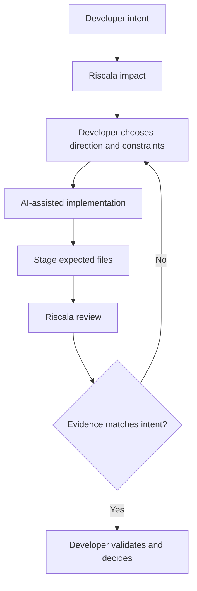

<p align="center">
  
</p>

<p align="center">
  
  
  
  =20.0.0" />
  
</p>

<p align="center">
  <strong>Keep AI work inside the objective, repository, scope, and authority you defined.</strong>
</p>

<p align="center">
  Preserve direction across chats. Stop unauthorized transitions. Verify the result stayed in bounds.
</p>

Riscala is a local, dependency-free governance layer for developers building software with AI. Beta.6 is being redesigned to preserve the active repository, objective, work mode, allowed scope, prohibitions, and stop conditions across chats and agents. The governing rule is that a new request does not automatically expand prior authority.

**Documentation:** start with the dependency-free web guide at [`docs/index.html`](docs/index.html), then use the Markdown reference for deeper governance contracts.

Riscala does not replace your coding agent, tell it how to program, choose product direction, or approve its own work. Coding agents can reason about implementation; the beta.6 target is to check their proposed actions against the boundary you defined and require an explicit transition when repository, objective, mode, or authority changes.

The existing beta.6-development `impact` and `review` commands remain read-only supporting experiments. They do not represent full semantic understanding and no longer define the product's primary value.

PSDM is the internal governance method. Its risk-scaled controls remain available when a change reaches security, data, AI, infrastructure, or production boundaries, but low-risk daily work does not require initialization or mandatory artifacts.

Riscala is currently beta software and is still distributed through the compatibility package `@ptechsolution/psdm-framework`. It is a local CLI and GitHub Action, not a hosted platform.

Create the active boundary for the current task:

```bash
npm install -g .
riscala work init "add search to the customer list" --mode implement --files src/search/**,tests/search/**
riscala work show
riscala adapters init
```

After meaningful progress, agent adapters require the coding agent—not the developer—to record a compact handoff:

```bash
riscala work handoff \
  --completed "implemented scope enforcement" \
  --validation "focused tests passed" \
  --decisions "keep enforcement deterministic" \
  --questions "none" \
  --pending "fresh-chat validation" \
  --next "open a new chat without context"
```

The current handoff replaces stale progress while lifecycle history records that a handoff occurred. A fresh agent must follow the exact next action unless it conflicts with the active boundary or a newer explicit developer instruction.

Riscala keeps a revisioned canonical copy in the local user configuration and treats `.riscala/ACTIVE_WORK.md` as its visible mirror. `riscala work show` refreshes stale snapshots before an agent evaluates authority. This supports local chat and workspace continuity on the same machine; remote or cross-device continuity is not implied.

`adapters init` connects Codex, Claude Code, Cursor, Windsurf, OpenCode, and Antigravity to the same `.riscala/ACTIVE_WORK.md` boundary without replacing existing agent instructions.

Before acting, every adapter must explicitly compare the new request with the active repository, objective, mode, allowed paths/actions, forbidden actions, and preservation rules. Each dimension is classified as aligned, conflicting, or unresolved. Aligned work continues without extra approval noise; a conflict or material uncertainty stops for a transition or missing decision. This is the control that correctly blocked a recovered next action when it belonged to a different objective.

Repository comparison is anchored before following any requested `cd`, target path, or workspace switch. The requested repository cannot supply the Active Work used to authorize entry into itself; changing repositories always requires resolving a transition from the initial repository boundary first.

The npm `@beta` tag installs `1.0.0-beta.6`.

The compatibility executable remains available:

```bash
psdm audit
```

## Table Of Contents

- [Why Riscala Exists](#why-riscala-exists)
- [Supporting Judgment Loop](#supporting-judgment-loop)
- [What Riscala Provides](#what-riscala-provides)
- [Status](#status)
- [Install](#install)
- [CLI](#cli)
- [Quick Start](#quick-start)
- [Model And Tool Independence](#model-and-tool-independence)
- [Knowledge As Code Layer](#knowledge-as-code-layer)
- [Common Workflows](#common-workflows)
- [Local Validation](#local-validation)
- [Contributing And Security](#contributing-and-security)
- [What PSDM Is Not](#what-psdm-is-not)
- [Examples](#examples)
- [Configuration](#configuration)
- [Feature Artifacts](#feature-artifacts)
- [Backend And Platform Governance](#backend-and-platform-governance)
- [Change Levels](#change-levels)
- [Production Gate](#production-gate)
- [GitHub Action](#github-action)
- [Design Principles](#design-principles)
- [Current Limitations](#current-limitations)

## Why Riscala Exists

AI can produce correct code and still be ungovernable: it can change the wrong repository, turn an experiment into implementation, expand scope, or continue after the developer's authority ended. Long conversations may recover control, but that direction is easily lost when the next chat starts.

An `AGENTS.md` provides general repository rules. It does not preserve the concrete boundary of today's task. Riscala keeps that active work compact and explicit while leaving final authority with the developer.

The beta.6 direction is defined in [`docs/ACTIVE_WORK.md`](docs/ACTIVE_WORK.md): continuity preserves direction; control stops or verifies actions at the boundary.

## Supporting Judgment Loop

Inside an authorized Active Work boundary, the existing read-only judgment path remains available:



## What Riscala Provides

- A compact Active Work contract for continuity across chats and explicit transitions when authority changes.
- Before-action boundary checks and after-action compliance verification as the beta.6 target direction.
- A read-only Judgment Brief before coding: observed facts, inferred impact, options, trade-offs, uncertainty, and decisions reserved for you.
- A staged Decision Review after coding: expected versus actual scope, sensitive surfaces, dependency changes, and missing evidence.
- `learn`, `balanced`, and `concise` explanation density for junior, senior, and staff-level workflows without changing authority or safety semantics.
- Optional PSDM adoption for durable specifications, architecture, security, testing, deployment, operations, and CI controls when the project needs them.
- Stable JSON output and compatibility with the existing `psdm` executable and npm package.

## Status

Latest published beta: `1.0.0-beta.6`.

Current `main` contains the beta.6 candidate centered on governable Active Work. The existing judgment commands and PSDM compatibility surface remain available.

## Install

Install the published beta.5 from npm:

```bash
npm install -g @ptechsolution/psdm-framework@beta
```

Then run:

```bash
riscala help
```

The beta.6 judgment loop documented below is under development on `main`. From this checkout, install it with `npm install -g .`. Do not expect `impact` or `review` from npm until beta.6 is published.

The existing `psdm` executable remains supported with identical commands and behavior during the Riscala migration. Both `riscala help` and `psdm help` work from the npm beta package.

For development from this checkout:

```bash
npm install -g .
```

Then run:

```bash
riscala help
```

The command reference below uses the primary `riscala` executable. Use `psdm` only when compatibility with older automation is needed; command behavior is identical.

## CLI

### Technical Judgment (beta.6 development)

Create or read the compact Active Work boundary used across chats:

```bash
riscala work init "add Google OAuth while preserving passwords" --mode design --files src/auth/**,tests/auth/**
riscala work show
```

`work init` creates `.riscala/ACTIVE_WORK.md` once and refuses to overwrite it. The file records repository, objective, mode, optional allowed paths, forbidden work, invariants, stop conditions, and categorized context. When `--files` is present, `/status` compares staged, unstaged, and untracked paths with that boundary and reports exact violations. Without `--files`, Riscala keeps the lightweight whole-repository behavior.

Build a read-only Judgment Brief from a proposed change without initializing PSDM artifacts:

```bash
riscala impact "add Google OAuth login while preserving passwords"
```

Adjust explanation density without changing the underlying facts or safety semantics:

```bash
riscala impact "add Google OAuth login" --guidance learn
riscala impact "add Google OAuth login" --guidance balanced
riscala impact "add Google OAuth login" --guidance concise
riscala impact "add Google OAuth login" --json
```

The brief separates observed repository evidence, inferred impact, options, advisory recommendation, uncertainty, and decisions reserved for the developer. `impact` is read-only, does not require `riscala init`, and never creates or simulates an owner decision.

After implementation, compare a CLI-declared expected file scope with the real Git index:

```bash
git add src/auth/login.mjs tests/auth/login.test.mjs
riscala review "add Google OAuth login" --staged \
  --files src/auth/login.mjs,tests/auth/login.test.mjs
```

`review` reports staged files outside the declared scope, expected files that are missing, observed and unexpected auth/schema/AI/config/deployment surfaces, package dependency changes, and the absence of supplied validation results. `scope_aligned_evidence_unverified` means only that staged scope aligns; it does not claim validation or approval. The Change Envelope is an advisory CLI input with `authorityVerified: false`; Decision Review never approves, commits, or establishes human authority.

Human-readable `review` output restores the language persisted in `.riscala/ACTIVE_WORK.md`; JSON keys remain English. In nested projects or monorepos, expected paths entered relative to the selected project are normalized to the Git root before comparison, avoiding false scope drift.

### Repository

```bash
riscala audit [target] [--json] [--feature <name>] [--config <path>]
riscala check [target] [--json] [--feature <name>] [--config <path>]
riscala validate [target] [--json] [--feature <name>] [--config <path>]
riscala report [target] [--json] [--feature <name>] [--config <path>]
riscala inspect --staged [--json] [--target <path>] [--config <path>]
```

### Interactive Shell

```bash
riscala shell [target] [--config <path>]
riscala action prepare git.commit [--target <path>] [--config <path>] [--json]
riscala approval verify git.commit --receipt <path> [--target <path>] [--config <path>] [--json]
riscala approval enforce git.commit [--receipt <path>] [--target <path>] [--config <path>] [--json]
riscala hook <install|remove|status> pre-commit [--target <path>] [--json]
```

The dependency-free shell is an operational governance console. It manages Active Work while showing branch, working-tree state, and active PSDM policy:

```text
/help
/work [inspect|experiment|design|implement|release] <objective>
/work transition <mode> <new objective>
/work continue
/work close
/language es|en
/init preview
/init confirm
/uninstall preview
/uninstall confirm
/status
/check
/report
/inspect
/classify <change description>
/pr-checklist <change description>
/init-preview
/hook-status
/action
/advanced
/exit
```

The main palette keeps the everyday workflow concise. `/advanced` opens an arrow-navigable submenu for `/approval`, `/audit`, `/impact`, `/review`, and `/validate`. These commands remain directly executable and script-compatible; only their menu presentation changes.

When `AGENTS.md` already exists, `/init confirm` preserves its content and appends only missing PSDM Required Reading, Boundaries, and Escalation sections. Repeating initialization does not duplicate the integration block.

For new or untouched PSDM documents, `/init confirm` inspects a bounded repository inventory and generates a project-specific baseline from detected languages, frameworks, directories, validation commands, deployment signals, and sensitive surfaces. It excludes secrets, `.env` files, data directories, virtual environments, dependencies, and build output. Existing edited documents are never overwritten; unknown business decisions remain explicit review questions.

`/uninstall preview` lists the Riscala state, untouched templates, configuration, and adapter blocks that can be removed from the current project. `/uninstall confirm` modifies the repository: it removes recognized Riscala-managed files and blocks while preserving user-modified documents. It does not delete application code or uninstall the global npm package.

The first screen restores `.riscala/ACTIVE_WORK.md`. If none exists, `/work <objective>` creates it with `implement` mode by default. `/work transition` records a proposed boundary without applying it; `/work continue` accepts it explicitly; `/work close` ends the work. Timestamped history remains in the file. Source code is changed by Codex, Claude, Cursor, or your preferred coding agent.

The shell starts in Spanish when the system locale begins with `es`; otherwise it uses English. `/language es|en` or `/lenguaje es|en` stores a global Riscala preference, applies it immediately, and restores it across repositories. Language changes presentation, never policy meaning or JSON keys.

Interactive terminals use Ptech cyan (`#00A8E8`) with a light accent (`#38BDF8`) for the Riscala frame and prompt. Color is automatically disabled for pipes, non-TTY output, `TERM=dumb`, and the `NO_COLOR` convention.

Type `/` at the interactive prompt to open the dependency-free command palette. Filter by typing, navigate with `↑`/`↓`, open submenus with `→` or `Enter`, return with `←` or `Esc`, and complete with `Tab`. Piped sessions preserve the original line-oriented behavior.

The Active Work boundary is intentionally stricter than a chat suggestion. In a verified continuity test, a fresh Codex chat recovered the recorded next action but refused to implement it because it fell outside the still-active objective. That stop was correct: the next task required an explicit Active Work transition. Riscala therefore preserved developer control across the chat boundary instead of silently expanding authority.

Shell commands use the same fixed-width result panels. Each result has a clear title, semantic state, and a contextual next action where useful, so repeated commands remain visually consistent without changing the read-only security boundary. `/audit` and `/init-preview` reuse the existing non-destructive audit engine. `/check`, `/validate`, and `/report` summarize baseline readiness. `/classify` and `/pr-checklist` prepare governance decisions from a described change. `/hook-status`, `/action`, and `/approval` expose the approval boundary without creating receipts, installing hooks, committing, pushing, or publishing.

### Initialization

```bash
riscala init [target]
riscala init [target] --dry-run
riscala init [target] --feature <name>
```

### Governance

```bash
riscala classify "<change description>" [--json] [--file <path>] [--files <path,path>] [--target <path>] [--config <path>]
riscala enforce "<change description>" [--json] [--max-level "Level 2"] [--file <path>] [--files <path,path>] [--target <path>] [--config <path>]
riscala pr-checklist "<change description>" [--json] [--file <path>] [--files <path,path>] [--target <path>] [--config <path>]
```

### Architecture

```bash
riscala adr "<decision title>" [--json] [--target <path>] [--date YYYY-MM-DD] [--status Proposed]
```

## Quick Start

Inside any greenfield or existing project—no initialization required:

```bash
# 1. Think before implementation.
riscala impact "add Google OAuth while preserving password login" \
  --files src/auth/login.ts,tests/auth/login.test.ts

# 2. Decide the direction yourself, then implement with your AI coding tool.

# 3. Stage only the implementation you expect to review.
git add src/auth/login.ts tests/auth/login.test.ts

# 4. Compare the result with the accepted intent and scope.
riscala review "add Google OAuth while preserving password login" --staged \
  --files src/auth/login.ts,tests/auth/login.test.ts
```

`impact` and `review` are advisory and read-only. They do not implement code, run tests, approve changes, or claim human authority. A scope-aligned review still reports validation evidence as unverified until you run and assess the relevant checks.

Use `--guidance learn` for more teaching, the default `balanced` mode for everyday work, or `--guidance concise` for compact senior/staff review. JSON output is available for automation.

Adopt the broader PSDM baseline only when durable project governance adds value:

```bash
riscala audit       # Preview adoption without writing files.
riscala init        # Create the selected governance baseline.
riscala validate    # Validate the adopted baseline.
```

See `docs/GETTING_STARTED.md` for greenfield, legacy, shell, and AI-agent examples.

Use `riscala audit` before initializing PSDM in an existing project. It does not modify files; it shows current state, what `riscala init` would create or skip, pros, cons, and recommendations.

If the repository already has `AGENTS.md`, Copilot, Cursor, Claude, Codex, skills, prompts, or AI instruction files, `riscala audit` reports adoption mode `integrate` and recommends preserving those files. During `riscala init`, PSDM creates `docs/PSDM_ADOPTION.md` so the integration plan is explicit.

`riscala audit --json` also emits `aiReadiness`, a stable contract for AI runtime readiness signals. It reports detected AI surfaces, governance artifact groups, gaps, and recommendations for guardrails, data classification, cost, latency, evals, prompt injection, PII, and tool security. Current detection covers common AI folders and manifest dependencies such as OpenAI, Anthropic, LangChain, LlamaIndex, vector stores, embeddings, and n8n. The contract is documented in `docs/AI_READINESS_AUDIT.md`.

`riscala init` also creates `psdm.config.json`. Existing files are skipped.

## Model And Tool Independence

PSDM is independent from any specific model, provider, coding assistant, or init command. It does not replace `claude init`, Cursor rules, Copilot instructions, Codex instructions, custom skills, prompts, or agent runtimes. It gives them a shared governance layer.

Teams customize PSDM through `psdm.config.json`, `AGENTS.md`, `docs/CHANGE_GOVERNANCE.md`, `docs/TOOL_REGISTRY.md`, and AI guardrail docs. Tool-specific files should adapt those rules for a given assistant, but must not weaken PSDM change-level, security, data, deployment, approval, or release boundaries.

See `docs/MODEL_AND_TOOL_INDEPENDENCE.md` for customization examples.

## Knowledge As Code Layer

PSDM treats knowledge as a first-class artifact. A project should not preserve only source code, but also intent, specifications, architectural decisions, business rules, agent instructions, workflows, prompts, verification criteria, and evolution notes as versioned knowledge assets.

Knowledge as Code is a transversal layer, not a new mandatory phase. Markdown and YAML in Git remain the source of truth. Obsidian can be used as an optional authoring tool; vector databases and graph databases are derived runtime indexes, not the primary record.

RAG retrieves semantically similar text fragments. A Knowledge Graph connects explicit entities and relationships such as rules, workflows, agents, systems, owners, and decisions. GraphRAG is an advanced evolution path, not a starting requirement.

See `docs/KNOWLEDGE_AS_CODE.md` for structure, tool roles, maturity levels, and an example knowledge note.

## Common Workflows

### Classify a Change

```bash
riscala classify "change Supabase RLS policy for client documents"
```

Expected result:

```text
Estimated level: Level 3
```

Machine-readable output:

```bash
riscala audit --json
riscala validate --json
riscala classify "change Stripe webhook ownership validation" --json
```

Classify by description and touched files:

```bash
riscala classify "small cleanup" --file backend/auth/session.py
```

Configured risk paths can raise the level even when the description is vague:

```text
Estimated level: Level 3
```

### Inspect Staged Changes

Inspect the Git index without writing files or requiring a change description:

```bash
riscala inspect --staged
```

The command reports staged file status, applies a Level 1 minimum to any real file change, and raises the result when a configured `riskPath` matches. It does not inspect unstaged or untracked files.

Use JSON output for automation:

```bash
riscala inspect --staged --json
```

The JSON contract includes `decision`, `git.changes`, `files`, `evidence`, and `classification`. `NO_STAGED_CHANGES` is a successful no-op; `NOT_A_GIT_REPOSITORY` exits non-zero.

### Open The Interactive Shell

Open the Active Work governance console in the current project:

```bash
riscala shell
```

Use `/status` to refresh project context and `/inspect` to review staged changes. Mutating slash commands remain blocked until trusted approvers and independent enforcement hooks are configured. See `docs/INTERACTIVE_SHELL.md` for the interface and safety contract.

### Prepare And Verify Approval

Create a machine-readable record for the exact staged diff:

```bash
riscala action prepare git.commit --json
```

After a trusted external signer returns a receipt, verify it against the live Git index:

```bash
riscala approval verify git.commit --receipt ./approval-receipt.json --json
```

Riscala does not sign receipts. Signing must happen through a hardware-backed or separately authenticated channel. See `docs/ACTION_RECORDS_AND_APPROVAL_RECEIPTS.md`.

Install the local pre-commit enforcement hook after a trusted approver is configured:

```bash
riscala hook install pre-commit
```

The hook is optional. When Active Work declares `--files`, it blocks staged files outside those paths before evaluating approval requirements. `/review` reports the same violations without approving or committing anything. Without declared paths, existing lightweight commit behavior remains unchanged.

The hook consumes a valid receipt once and blocks invalid or missing Level 3/4 approval. It preserves existing unmanaged hooks instead of overwriting them. Local hooks can still be bypassed with Git options or filesystem control, so protected branches and remote required checks remain necessary for agent-resistant enforcement.

### Solo Maintainer And Team Mode

Riscala separates local governance from repository ownership rules:

- solo maintainer mode keeps required CI checks, admin enforcement, conversation resolution, and blocked force pushes/deletions, but does not require an approving reviewer;
- team mode should add at least one required approving review from a maintainer with write access;
- high-risk Level 3/4 changes still require content-bound approval when project policy says approval is required.

This keeps the product usable for one maintainer without weakening the path to team governance later.

### Generate A PR Checklist

Generate a PR checklist:

```bash
riscala pr-checklist "change auth session validation" --file backend/auth/session.py
```

### Enforce In CI

Enforce a maximum level in CI:

```bash
riscala enforce "small cleanup" --file src/index.mjs --max-level "Level 2"
```

### Create An ADR

Create an ADR:

```bash
riscala adr "Adopt CI change level enforcement"
```

## Local Validation

Run local fixtures:

```bash
npm test
```

Run the non-publishing release gate:

```bash
npm run release:check
```

Use `npm run release:check -- --allow-dirty` only when validating local changes before commit.

Beta release scope and exit criteria are tracked in `docs/BETA_RELEASE_NOTES.md`.

The public documentation index is `docs/INDEX.md`.

## Contributing And Security

Public contribution expectations are in `CONTRIBUTING.md` and `CODE_OF_CONDUCT.md`.

Security reporting expectations are in `SECURITY.md`. Do not open public issues for secrets, credentials, exploitable behavior, private repository output, or customer data.

## What PSDM Is Not

PSDM is not a hosted observability platform, a runtime security product, a secret scanner, or a replacement for owner approval. It provides governance artifacts, local validation, change classification, CI enforcement hooks, and AI-agent guardrail templates.

## Examples

`examples/nextjs-saas` is a lightweight SaaS/AI fixture used by `npm test`.

It is not a runnable application. It exists to prove that PSDM can audit, initialize, and validate a downstream-like project with package metadata, prompt assets, and an AI-assisted backend surface without requiring external services or dependency installation.

## Configuration

`psdm.config.json` is optional. When it is absent, PSDM uses the default baseline artifacts.

Minimal example:

```json
{
  "profile": "backend-api"
}
```

Use the README to start. Use `docs/CONFIG_SCHEMA.md` for the full schema, supported fields, compatibility rules, AI policy fields, and `riskPaths` examples.

Supported profiles:

```text
standard
framework
backend-api
ai-agent
saas
monorepo
```

Profiles add sensible default artifacts and risk paths for common repository types. Explicit config still wins for project-specific policy.

The `ai-agent` profile adds guardrail artifacts for AI runtime governance:

```text
docs/AI_GUARDRAILS.md
docs/DATA_CLASSIFICATION.md
docs/COST_LATENCY_BUDGET.md
docs/PROMPT_INJECTION_TESTS.md
docs/AI_EVALS.md
```

These artifacts define policy, evidence, owners, gates, and accepted external reports. They do not turn PSDM into a native tracing, observability, or hosted eval platform.

Unsupported profile values fail validation instead of silently falling back to `standard`. The validation JSON still reports `config.profile.name` and `config.profile.recognized` so automation can surface the exact policy problem.

Schema stability rules are documented in `docs/CONFIG_SCHEMA.md`.

The optional `ai` block declares repository-level AI policy for PII, redaction, cost budgets, latency SLOs, tool registry expectations, eval requirements, prompt-injection testing, and human approval. `null` means the policy is intentionally not declared yet; invalid field types fail validation.

Use a non-default config path:

```bash
riscala validate --config ./governance/psdm.config.json
```

## Feature Artifacts

For product changes that should not require rewriting the whole project baseline, create scoped artifacts:

```bash
riscala init --feature billing
riscala validate --feature billing
```

Default feature paths:

```text
docs/features/<feature>/PROJECT_BRIEF.md
docs/features/<feature>/SPEC.md
docs/features/<feature>/ARCHITECTURE.md
docs/features/<feature>/SECURITY.md
docs/features/<feature>/TESTING.md
```

## Backend And Platform Governance

PSDM governs the whole repository, but its strongest controls usually apply to backend and platform surfaces:

- authentication and authorization;
- payments and billing;
- database migrations;
- infrastructure and deployment;
- AI agents and RAG pipelines;
- CI/CD workflows.

These controls live in `riskPaths`. A matching path raises the minimum change level even when the textual change description looks low risk.

`riscala inspect --staged` obtains touched paths directly from the Git index, so developers do not need to repeat them through `--file` or `--files` before review.

`riscala validate` fails when `riskPaths` contains malformed rules. Invalid risk path rules are ignored by classification so a broken local policy does not crash the CLI.

## Change Levels

| Level | Meaning | Governance |
|---|---|---|
| Level 0 | Safe trivial change | Diff review only. |
| Level 1 | Local low-risk code change | Scope note, relevant docs, narrow validation. |
| Level 2 | Product behavior change | Product spec, tasks, testing, architecture review if needed. |
| Level 3 | Security / data / payment / AI change | Spec, architecture, security, testing, owner approval. |
| Level 4 | Deployment / operations / infrastructure change | Deployment, operations, rollback plan, explicit production confirmation. |

## Production Gate

Production execution is never implied.

Commands that mutate production require exact owner confirmation:

```text
CONFIRM PRODUCTION DEPLOY
```

## GitHub Action

This repository includes a composite GitHub Action:

Replace `<owner>` with the public GitHub owner for the repository.

```yaml
steps:
  - uses: actions/checkout@v4
  - uses: <owner>/psdm-framework@main
    with:
      target: .
```

The action writes `psdm-report.json` and fails when validation has blocking failures.

Enable change-level enforcement:

```yaml
steps:
  - uses: actions/checkout@v4
  - uses: <owner>/psdm-framework@main
    with:
      target: .
      enforce-change-level: 'true'
      change-description: ${{ github.event.pull_request.title }}
      files: src/index.mjs,docs/SPEC.md
      max-level: Level 2
```

The action writes `psdm-enforcement.json` and fails when the classified change exceeds `max-level`.

## Design Principles

- Risk-scaled governance.
- Specification before significant implementation.
- Knowledge as a versioned project asset.
- Explicit AI-agent boundaries.
- Agents justify meaningful mutations but cannot authorize their own high-risk actions.
- Security-sensitive work requires security context.
- Deployment-sensitive work requires rollback context.
- Documentation must support delivery, not replace it.

## Current Limitations

This beta does not yet provide:

- Full AI agent security runtime guardrail enforcement.
- Tool registry enforcement.
- Deep code-level semantic AI readiness detection.
- SBOM or supply-chain scanning.
- Deep semantic validation of specs.
- Remote approval service, remote replay persistence, or hardware signing ceremony integration.

Freshly initialized templates intentionally contain placeholders. `riscala validate` reports them as warnings and returns `METHOD_BASELINE_REVIEW_REQUIRED` until the artifacts are filled with project-specific content.

See `docs/ROADMAP.md`.

---

Built by Ptech AI Applied Lab

PSDM is the open governance framework behind the PTECH SPEC-DRIVEN METHOD.

Specification-first AI Engineering.

https://ptechsolution.net
